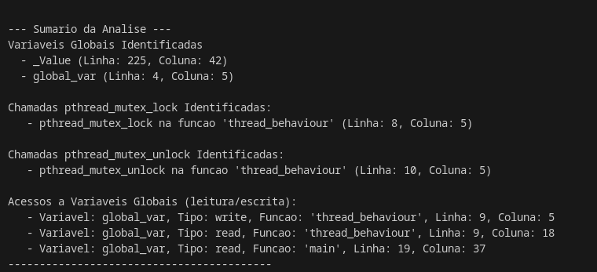

# Relatório de Status - 24 de Julho de 2025

**Projeto:** Verificação de Data Races em Programas Concorrentes via SAT Solver

---

## 1. Introdução

Este documento detalha o progresso do projeto final da disciplina de Sistemas Operacionais em 24 de Julho de 2025. O objetivo geral do projeto é desenvolver uma ferramenta para identificar **data races** em programas concorrentes escritos em C, utilizando análise estática e um SAT Solver. Conforme o planejamento ajustado no README do projeto, o foco atual é aprofundar a análise estática para identificar acessos a variáveis e mapeá-los ao contexto de execução.

---

## 2. Ambiente de Desenvolvimento Configurado

O ambiente de desenvolvimento permanece configurado conforme o relatório anterior:

- **Sistema Operacional:** Fedora Linux.
- **Python:** Versão 3.x instalada e configurada com `pip`.
- **Ambiente Virtual:** Um ambiente virtual (`venv_os_project`) foi criado e ativado para gerenciar as dependências do projeto.
- **`pycparser`:** A biblioteca `pycparser` foi instalada via `pip` dentro do ambiente virtual. A correção para a inclusão de arquivos "falsos" (`fake_libc_include`) ainda é fundamental para o pré-processamento de códigos C padrão (`pthread.h`, `stdio.h`).
- **SAT Solver:** A integração com um SAT Solver (MiniSAT ou Z3) está planejada para etapas futuras do projeto.

---

## 3. Análise Estática Aprimorada com `pycparser`

A fase de análise estática foi significativamente aprimorada, dando continuidade ao script iniciado em 22 de Julho. O script Python (`src/ast_parser.py`) foi estendido para não apenas parsear o código C e gerar sua Árvore de Sintaxe Abstrata (AST), mas também para realizar uma identificação detalhada de acessos de leitura e escrita a variáveis globais e associá-los ao contexto de execução (função/thread), atendendo aos objetivos definidos para esta etapa.

### 3.1. Código C de Exemplo (`tests/example.c`)

Para demonstrar as capacidades aprimoradas do analisador, o seguinte código C foi utilizado:

```c
#include <pthread.h>
#include <stdio.h>

int global_var = 10;

void* thread_behaviour(void* arg) {
    pthread_mutex_t* my_lock = (pthread_mutex_t*)arg;
    pthread_mutex_lock(my_lock);
    global_var = global_var + 1;
    pthread_mutex_unlock(my_lock);
    return NULL;
}

int main() {
    pthread_t thread1;
    pthread_mutex_t lock = PTHREAD_MUTEX_INITIALIZER;
    pthread_create(&thread1, NULL, thread_behaviour, &lock);
    pthread_join(thread1, NULL);
    printf("Variavel Global: %d\n", global_var);
    return 0;
}
```

### 3.2. Resultados da Análise Aprimorada

O analisador foi executado sobre o código de exemplo, e os seguintes resultados foram obtidos, demonstrando a capacidade de identificar variáveis globais, chamadas de funções de sincronização e, crucialmente, acessos de leitura e escrita a variáveis globais, mapeados às suas respectivas funções.

- **Variáveis Globais Identificadas**: O analisador agora consegue identificar todas as declarações de variáveis no escopo global, como `global_var` na linha 4. (Nota: `_Value` pode aparecer como um artefato da análise dos "fake includes", o que é um comportamento esperado do `pycparser` neste contexto).
- **Chamadas de Sincronização**: As chamadas para `pthread_mutex_lock` (linha 8) e `pthread_mutex_unlock` (linha 10) são corretamente detectadas e associadas à função `thread_behaviour`.
- **Acessos a Variáveis Globais (Leitura/Escrita)**:
  - Na linha 9, a expressão `global_var = global_var + 1` é corretamente decomposta em uma operação de leitura de `global_var` (lado direito da atribuição) e uma operação de escrita em `global_var` (lado esquerdo da atribuição), ambas ocorrendo na função `thread_behaviour`.
  - Na linha 19, a chamada `printf("Variavel Global: %d\n", global_var)` resulta em uma operação de leitura de `global_var` dentro da função `main`.

Esses resultados demonstram um avanço significativo na identificação detalhada de acessos e sua associação a contextos de execução, alinhando-se com os objetivos estabelecidos para esta etapa do projeto.

## 4. Dificuldades Encontradas

A principal dificuldade encontrada nesta fase foi a implementação de uma lógica robusta para diferenciar e capturar todos os casos de leitura de variáveis globais. Dado que as leituras podem ocorrer em diversos contextos (lado direito de atribuições, argumentos de funções, expressões lógicas, retornos de função, etc.), foi necessário desenvolver uma função auxiliar (\_find_reads_in_expr) para percorrer recursivamente os nós da AST e identificar esses usos.

## 5. Resultado Obtido


