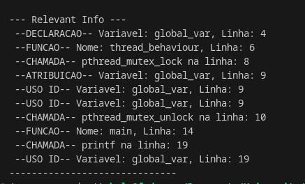

# Relatório de Status - 22 de Julho de 2025

**Projeto:** Verificação de Data Races em Programas Concorrentes via SAT Solver

---

## 1. Introdução

Este documento apresenta o status inicial do projeto final da disciplina de Sistemas Operacionais. O objetivo geral do projeto é desenvolver uma ferramenta para identificar **data races** em programas concorrentes escritos em C, utilizando análise estática e um SAT Solver.

---

## 2. Ambiente de Desenvolvimento Configurado

Para o desenvolvimento do projeto, o ambiente foi configurado da seguinte forma:

- **Sistema Operacional:** Fedora Linux.
- **Python:** Versão 3.x instalada e configurada com `pip`.
- **Ambiente Virtual:** Um ambiente virtual (`venv_os_project`) foi criado e ativado para gerenciar as dependências do projeto.
- **`pycparser`:** A biblioteca `pycparser` foi instalada via `pip` dentro do ambiente virtual.
  - **Correção de Problemas de Instalação:** Foi necessário realizar o download manual da pasta `utils` do repositório oficial do `pycparser` no GitHub e copiá-la para o diretório de instalação do `pycparser` no ambiente virtual (`/home/user/.../site-packages/pycparser/utils`). Esta etapa foi crucial para resolver problemas relacionados à ausência de arquivos de inclusão "falsos" (`fake_libc_include`) necessários para o pré-processamento de códigos C padrão (`pthread.h`, `stdio.h`).
- **SAT Solver:** A integração com um SAT Solver (MiniSAT ou Z3) está planejada para as próximas etapas do projeto.

---

## 3. Análise Estática Inicial com `pycparser`

A primeira fase do projeto envolve a análise estática do código fonte C para extrair informações relevantes sobre variáveis e chamadas de funções de sincronização. Foi desenvolvido um script Python (`src/ast_parser.py`) que utiliza a biblioteca `pycparser` para:

- **Parsear** um arquivo C e gerar sua Árvore de Sintaxe Abstrata (AST).
- **Navegar** pela AST para identificar elementos-chave.

### 3.1. Código C de Exemplo (`tests/example.c`)

Para testar a capacidade inicial de parsing, o seguinte código C foi utilizado:

```c
// tests/simple_example.c
#include <pthread.h>
#include <stdio.h>

int global_var = 10; // Variável global

void* my_thread_func(void* arg) {
    pthread_mutex_t* my_lock = (pthread_mutex_t*)arg;
    pthread_mutex_lock(my_lock); // Chamada de lock
    global_var = global_var + 1; // Acesso a variável global (escrita)
    pthread_mutex_unlock(my_lock); // Chamada de unlock
    return NULL;
}

int main() {
    pthread_t t1;
    pthread_mutex_t lock = PTHREAD_MUTEX_INITIALIZER;
    pthread_create(&t1, NULL, my_thread_func, &lock);
    pthread_join(t1, NULL);
    printf("Global var: %d\n", global_var);
    return 0;
}
```

## 4. Resultado Obtido


